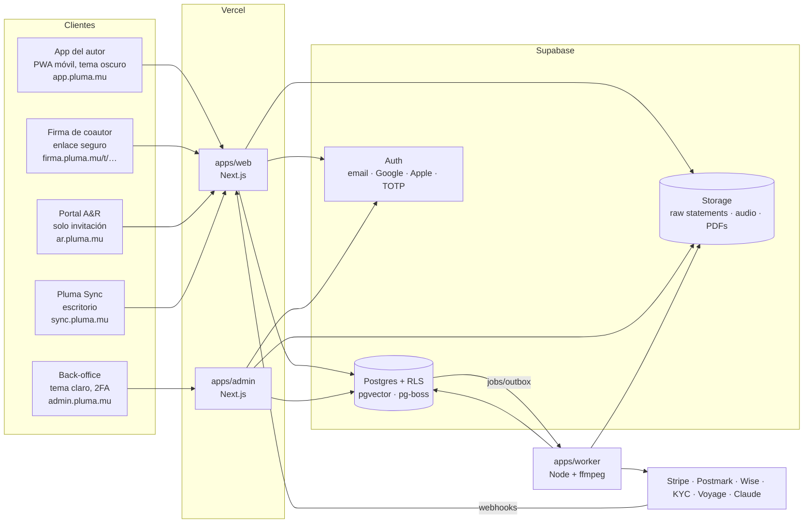
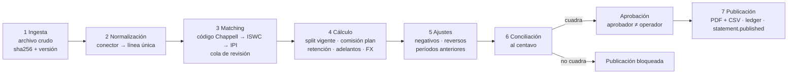

# Pluma — Plan de arquitectura (v0.1, para aprobación)

> "Donde nacen las canciones." Escribe. Firma. Cobra.

Este documento es el entregable 1: arquitectura, decisiones técnicas y plan por fases. El esquema de datos está en [`02-modelo-de-datos.md`](./02-modelo-de-datos.md) y [`schema.sql`](./schema.sql); las pantallas, en [`03-pantallas.md`](./03-pantallas.md); lo que necesito que decidas, en [`04-decisiones-abiertas.md`](./04-decisiones-abiertas.md).

---

## 1. Stack: qué se mantiene y qué propongo cambiar

Mantengo el stack sugerido y lo concreto. Propongo cinco ajustes, todos justificados abajo.

| Capa | Elección | Por qué |
|---|---|---|
| Monorepo | **pnpm + Turborepo** | Tres apps web y un worker comparten dominio, tipos, i18n y diseño. Un solo repo evita que el cálculo de regalías se duplique. |
| Frontend | **Next.js 15 (App Router) + TypeScript + Tailwind v4** | Como se sugirió. Tailwind se usa solo con los tokens de Pluma (sin preset de componentes). |
| Componentes | **Sistema propio `@pluma/ui`** sobre primitivas sin estilo (Radix Primitives para diálogos, menús y switches accesibles) | Cumple "nada de librerías con su apariencia por defecto" sin reimplementar accesibilidad de teclado y lectores de pantalla. |
| PWA | `next-pwa` / Serwist (service worker, manifest, íconos) | App del autor instalable; push web. |
| i18n | **next-intl** con `messages/es.json`, `en.json`, `pt-BR.json` | Soporta ICU (plurales, monedas, fechas), Server Components y rutas por idioma. |
| Base de datos | **Supabase Postgres 16** + Auth + Storage + RLS + **pgvector** | Como se sugirió. |
| Acceso a datos | **Drizzle ORM** + migraciones SQL versionadas | *Ajuste 1.* Tipos de TS generados del esquema; las políticas RLS, triggers y vistas viven en SQL plano dentro de las migraciones, revisables en PR. |
| Cola de trabajos | **pg-boss** (cola sobre el mismo Postgres) | *Ajuste 2.* Sin infraestructura extra (Redis), transaccional con el outbox de eventos, reintentos y cron incluidos. Si el volumen crece, la interfaz `JobQueue` permite migrar a Inngest o SQS. |
| Worker | **Node 22** en contenedor (Fly.io o Railway) con **ffmpeg** | Ingesta de statements, PDFs, marcas de agua de audio, envíos masivos y embeddings. Vercel no sirve para trabajos largos ni para ffmpeg. |
| Dinero | **decimal.js** en dominio; `numeric(20,6)` en líneas y `bigint` en centavos en saldos | Nunca `float`. Ver §5. |
| PDFs | **@react-pdf/renderer** en el worker | PDF con marca Pluma sin navegador headless; mismo componente de datos que el dashboard → el PDF coincide con lo que ve el autor. |
| Correo | **Postmark** (+ React Email para plantillas por idioma) | *Ajuste 3.* Mejor entregabilidad transaccional y webhooks de entrega, rebote y apertura, que el módulo de publicación de statements exige. Resend es alternativa válida. |
| Push | **Web Push (VAPID)** | Nativo de la PWA, sin proveedor. WhatsApp: adaptador opcional (Meta Cloud API) en fase posterior. |
| Membresía | **Stripe Billing** (suscripción anual, prorrateo, cambios programados, Stripe Tax opcional) | Como se sugirió. |
| Payouts | Adaptador `PayoutProvider` → **Wise Business** como primera implementación | Semiautomático: el operador arma el lote, un aprobador distinto lo autoriza y el worker lo envía. Payoneer queda como segunda implementación. *A confirmar.* |
| KYC | Adaptador `KycProvider` → **MetaMap o Truora** (cobertura de documentos LatAm + Brasil) | *Ajuste 4.* Stripe Identity cubre mal cédulas de la región. *A confirmar.* |
| Firma digital | **Propia**, con evidencia (ver §6) | Como se sugirió. |
| Búsqueda sync | **Híbrida**: filtros SQL + texto completo (`tsvector`) + vector (`pgvector`, embeddings **Voyage**) + Claude para traducir la consulta en lenguaje natural a filtros | *Ajuste 5.* La búsqueda solo vectorial falla con restricciones duras ("instrumental, 90–100 BPM"); el modelo extrae filtros y el vector ordena por afinidad. |
| Observabilidad | Sentry + logs estructurados (pino) + métricas de colas | |
| Pruebas | **Vitest** (dominio y conectores), **Playwright** (criterios de aceptación de punta a punta) | |

## 2. Aplicaciones y dominios



- **`apps/web`** sirve cuatro superficies con *route groups* y reescritura por host en el middleware: `(author)`, `(sign)`, `(ar)`, `(sync)`. Comparten sesión, i18n y componentes, pero cada una tiene su layout, su tema y sus guardas de rol.
- **`apps/admin`** es una app separada a propósito: dominio distinto, 2FA obligatorio (Supabase MFA `aal2`), lista de IPs opcional y nunca se empaqueta código interno en el bundle del autor.
- **`apps/worker`** consume la cola y el outbox. Es el único proceso con la *service role key* para tareas masivas.

### Estructura del repositorio

```
apps/
  web/         Next.js: autor (PWA), firma de coautor, portal A&R, Pluma Sync
  admin/       Next.js: back-office
  worker/      Node: jobs (ingesta, cálculo, PDFs, audio, correo, embeddings)
packages/
  domain/      Lógica pura y probada: dinero, splits, distribución, conciliación, membresía, cuotas
  db/          Esquema Drizzle, migraciones SQL (tablas, RLS, triggers), seed
  connectors/  StatementConnector (interfaz) + warner-chappell/
  adapters/    Pagos (Stripe), payouts (Wise), KYC, correo, push, embeddings, TSA
  ui/          Design system Pluma (tokens, componentes, íconos, logo SVG)
  i18n/        Mensajes es / en / pt-BR, formato de moneda y fechas
  emails/      Plantillas React Email por evento e idioma
  pdf/         Plantillas de statement y certificado de retención
fixtures/
  statements/  Archivo ficticio de Chappell + resultados esperados
```

`packages/domain` no importa nada de Next, Supabase ni de proveedores: recibe datos y devuelve resultados. Así el cálculo es reproducible y se prueba sin base de datos.

## 3. Seguridad y acceso

- **Autenticación**: Supabase Auth (correo con verificación, Google, Apple). Personal interno con TOTP obligatorio.
- **Roles**: tabla `user_roles` (un usuario puede ser autor y A&R a la vez). Los roles viajan en el JWT mediante un *custom access token hook*.
- **RLS en todas las tablas**. Reglas principales:
  - Un autor ve sus obras y las obras donde tiene una participación; ve sus distribuciones, statements y payouts.
  - Las obras con `ar_opt_in` se exponen a A&R **solo a través de una vista** con columnas limitadas (sin letra completa, sin splits, sin datos del autor más allá del nombre artístico).
  - Igual para Sync (`sync_catalog_v`).
  - El back-office opera con funciones `security definer` que verifican el rol y escriben en auditoría; nunca con la *service key* desde el navegador.
- **Coautor invitado**: sin cuenta. Token aleatorio de 256 bits, guardado como hash, de un solo uso por versión de split, con caducidad de 14 días y verificación por código de 6 dígitos al correo antes de firmar.
- **Datos sensibles** (ID fiscal, datos bancarios, documentos KYC, datos de menores): cifrado de columna con `pgsodium`/Vault + bucket privado; acceso solo por funciones auditadas.
- **Auditoría inmutable**: `audit_log` *append-only* (trigger que bloquea `UPDATE` y `DELETE`, sin permisos para ningún rol de aplicación) y encadenado por hash (`hash = sha256(prev_hash || fila)`); una tarea diaria verifica la cadena. Todo cambio sobre dinero, splits, contratos, planes y tarifas pasa por triggers de auditoría, no por la buena voluntad del código.
- **Archivos crudos**: bucket `statements-raw` sin permiso de sobrescritura; ruta con `sha256`; una nueva carga del mismo período crea una versión nueva, nunca reemplaza.
- **Privacidad** (Habeas Data, LGPD, CCPA): consentimiento por finalidad, registro de tratamiento, exportación y borrado del titular (las obligaciones contables y contractuales prevalecen sobre el borrado: se anonimiza el perfil, se conservan los asientos), datos de menores restringidos (no aparecen en la red ni en catálogos públicos sin autorización del tutor).

## 4. Sistema de eventos y notificaciones

Patrón **transactional outbox**: cada acción de dominio escribe su evento en `domain_events` dentro de la misma transacción. El worker los despacha a *handlers* que crean `notifications` con una **clave de idempotencia única** (p. ej. `statement.published:{writer}:{period}`), y por cada notificación una entrega por canal (correo, push y, más adelante, WhatsApp) en el idioma del destinatario.

Eventos del MVP:

| Evento | Destinatarios |
|---|---|
| `split.invitation_sent` / `split.reminder` / `split.signed` / `split.completed` / `split.rejected` | Coautores, creador |
| `work.status_changed` (enviada, registrada, en disputa) | Autores de la obra |
| `work.conflict_detected` | Autor y operador |
| `application.submitted` / `application.reminder_72h` / `application.expired` / `application.accepted` / `application.declined` | Publicador y postulante |
| `collaboration.closed` → `work.created` | Ambas partes |
| `statement.published` | Cada autor del período (variantes con saldo y saldo cero) |
| `royalties.unclaimed_detected` | Autor |
| `hold.requested` / `hold.decided` · `license.requested` / `license.decided` | Autor, A&R o comprador, operador |
| `membership.renewal_upcoming` (−15 días) / `membership.payment_failed` / `membership.grace_ended` | Autor |
| `payout.requested` / `payout.sent` | Autor, operador |

Los recordatorios con tiempo (72 h, 7 días, −15 días, fin de gracia) son trabajos programados de pg-boss. Los webhooks de Postmark actualizan entrega, rebote y apertura.

## 5. Pipeline de statements (corazón técnico)



### Interfaz del conector

```ts
interface StatementConnector {
  provider: ProviderCode;                       // 'warner_chappell'
  detect(file: RawFile): Promise<boolean>;      // ¿este archivo es mío?
  parse(file: RawFile): AsyncIterable<RawLine>; // lectura en streaming del formato del proveedor
  normalize(line: RawLine, ctx: NormalizeCtx): NormalizedLine | NormalizeError;
  controlTotals(file: RawFile): Promise<ControlTotals>; // total declarado por el proveedor
  exportNewWorks?(works: WorkForRegistration[]): Promise<ExportFile>; // alta de obras
}
```

Chappell es la primera implementación. Un registro directo en sociedades u otro administrador será otra implementación del mismo contrato; los pasos 3 a 7 no cambian. Como el formato de Chappell está *a confirmar*, el conector se construye con un **mapeo de columnas declarativo** (YAML versionado) y un *fixture* ficticio; cuando llegue el formato real solo cambia el mapeo.

### Reglas de cálculo

1. **Base**: el importe que Chappell paga a Pluma por la línea (`net` del proveedor). *A confirmar* (ver decisiones abiertas).
2. **Split**: la versión firmada vigente al **último día del período de explotación** de la línea. Si la obra está `en disputa`, las distribuciones se calculan pero quedan **retenidas**.
3. **Solo se distribuye a socios**. Las participaciones de coautores externos son informativas; si Chappell paga por ellas por error, la parte va a **suspenso** para revisión, no a un autor.
4. **Comisión**: `commission_bps` del plan que el autor tenga en la **fecha de publicación**, tomada de `membership_plan_periods`. Si el plan cambia entre el cálculo y la publicación, la corrida queda invalidada y debe recalcularse (la conciliación se invalida con ella).
5. **Retención fiscal**: tabla `tax_withholding_rules` por país de residencia fiscal, tipo de ingreso y vigencia.
6. **Adelantos**: recuperación del saldo pendiente hasta cubrirlo (tabla preparada; emitir adelantos está fuera del MVP).
7. **FX**: conversión a la moneda de pago del autor con la tasa registrada en `fx_rates` (fuente, fecha y hora); la tasa usada queda en cada distribución.
8. **Redondeo**: el cálculo interno usa 6 decimales; a centavos se pasa **una sola vez por statement de autor**, con **método del mayor residuo**, de modo que la suma de centavos asignados es exactamente el total recibido. El residuo de redondeo se registra explícitamente (nunca se "pierde").
9. **Saldo negativo**: si un statement queda negativo, el saldo se arrastra como asiento de apertura del período siguiente; nunca se cobra al autor.

### Ecuación de conciliación (al centavo, por moneda recibida)

```
Recibido de Chappell
  = Σ neto a autores (pagable)
  + Σ comisión Pluma
  + Σ retenciones fiscales
  + Σ recuperación de adelantos
  + Σ retenido (obras en disputa)
  + Σ suspenso (líneas sin match o partes no administradas)
  + Σ residuo de redondeo
```

Además: total de líneas parseadas = total de control declarado por el archivo. Si cualquiera de las dos diferencias ≠ 0,00, el botón **Publicar** no se habilita. La corrida guarda un *snapshot* de parámetros (tarifas, comisiones, tasas FX, reglas fiscales, versiones de split); recalcularla con el mismo snapshot da exactamente el mismo resultado (se prueba).

### Ledger del autor

El saldo no es un campo editable: es la suma de `writer_ledger_entries` (crédito de statement, débito de payout, ajuste, arrastre). El dashboard, el PDF y el payout leen la misma fuente.

## 6. Firma digital con evidencia

1. Se genera el documento a firmar (contrato, split sheet de una versión) como PDF y se calcula su `sha256`.
2. El firmante lo ve, confirma con un código enviado a su correo (o sesión autenticada con verificación reciente) y pulsa "Firmar".
3. Se guarda en `signatures`: hash del documento, nombre, correo, IP, user-agent, hora de servidor, método, y si firma en nombre de un menor, los datos del tutor.
4. Al completarse todas las firmas se emite un **certificado de evidencia** (PDF anexo) y se sella su hash con una autoridad de sellado de tiempo **RFC 3161**.

Es una firma electrónica simple con evidencia reforzada, válida bajo Ley 527/1999 (Colombia), ESIGN/UETA (EE. UU.) y MP 2.200-2 (Brasil). El adaptador permite migrar a un proveedor externo si el área legal lo exige.

**Prueba de autoría**: al crear la obra se calcula `sha256(audio)` y `sha256(letra normalizada)` y se sella con RFC 3161. La respuesta del TSA se guarda junto a la obra.

## 7. Audio protegido

- Al subir un demo, el worker genera con ffmpeg una **versión de escucha**: MP3 128 kbps con marca de agua audible (firma sonora "pluma" cada 20–30 s) y un identificador inaudible por usuario cuando la escucha es en la red o en catálogos.
- El original nunca se sirve fuera del back-office.
- La reproducción usa un *endpoint* propio que emite **URLs firmadas de 60 s** con soporte de *Range*, sin botón de descarga, y registra cada escucha en `audio_plays`.
- Nota honesta: ningún streaming web es imposible de grabar; el objetivo es disuasión, trazabilidad y que el material que circula esté marcado.

## 8. Membresía (Stripe)

- Suscripción anual con precio por plan (y por región cuando se defina: `plan_prices.region`).
- **Mejora a Pro**: inmediata, `proration_behavior = always_invoice`.
- **Bajada a Socio**: *subscription schedule* al final del período.
- Aviso a −15 días, reintentos de cobro y **gracia de 15 días** (`past_due`). Al vencer: `suspended` → se apagan red, opt-ins de sync y A&R (las obras se ocultan de los catálogos, el opt-in se recuerda para restaurarlo); administración y regalías continúan.
- Cada cambio efectivo de plan escribe una fila en `membership_plan_periods`, que es la fuente de verdad para la comisión.
- Precios, comisiones, límites diarios de postulaciones y beneficios viven en `plans.features` y son editables por super admin (auditado).

## 9. Despliegue y entornos

| Entorno | Datos | Notas |
|---|---|---|
| Local | Supabase CLI (Docker) + seed trilingüe | `pnpm dev` levanta web, admin y worker. Postmark en modo sandbox, Stripe en modo test. |
| Staging | Proyecto Supabase separado, datos ficticios | Previews de Vercel por PR. |
| Producción | Supabase (región us-east-1), Vercel, worker en Fly.io | Backups PITR, cifrado en reposo del proveedor, secretos en el gestor de cada plataforma. |

CI (GitHub Actions): lint, typecheck, pruebas de `domain` y `connectors`, migraciones contra un Postgres efímero, Playwright para los criterios de aceptación.

## 10. Fases de construcción

| Fase | Alcance | Criterio de cierre |
|---|---|---|
| **0. Base** | Monorepo, design system (tokens, logo SVG, componentes), i18n, Auth, esquema, RLS, auditoría, seed | Login en los tres idiomas; pantallas con identidad Pluma. |
| **a. Onboarding, obras y splits** | Bienvenida, registro, perfil, KYC (stub), contrato, menor + tutor, planes + Stripe, obras, splits, firma de coautor, versiones, prueba de autoría, conflictos, disputas, exportación de alta | Criterios 1 y 2. |
| **b. Statements y dashboard** | Conector Chappell + fixture, pipeline completo, cola de matching, conciliación, doble aprobación, PDFs/CSV, ledger, dashboard, alertas, retiros | Criterio 3 y pruebas automáticas de distribución y conciliación. |
| **c. Notificaciones** | Outbox, Postmark, push, plantillas por idioma, publicación con vista previa, prueba, programación e idempotencia | Criterio 4. |
| **d. Red Pluma** | Tablero, solicitudes, postulaciones, cuotas por plan, aceptación, cerrar canción, perfiles, créditos, audio protegido | Criterio 5. |
| **e. A&R y Sync** | Opt-ins Pro, portal A&R e invitaciones, holds, Pluma Sync, búsqueda híbrida, cotizador, solicitudes de licencia, briefs | Criterio 6. El criterio 7 (auditoría) se verifica en todas las fases. |

Cada fase se entrega en su propio PR con pruebas y una nota de cambios.

## 11. Fuera del MVP, sin bloquearlo

- **Chat propio**: `collaborations` ya tiene identidad de conversación; se añadiría `messages` sin migrar nada.
- **Adelantos**: la tabla `advances` y la recuperación ya existen en el cálculo.
- **Cobro de holds**: `holds` tiene campos de precio nulos.
- **Licenciamiento a IA**: `works.ai_training_opt_in` preparado y siempre `false`.
- **White-label**: las tablas raíz (perfiles de autor, obras, planes y períodos de statements) llevan `publisher_id` (hoy, una sola fila "Pluma").
- **App nativa**: la PWA y la API de Route Handlers sirven a un futuro cliente móvil.
- **Registro directo en sociedades**: otra implementación de `StatementConnector` y del exportador de altas.
