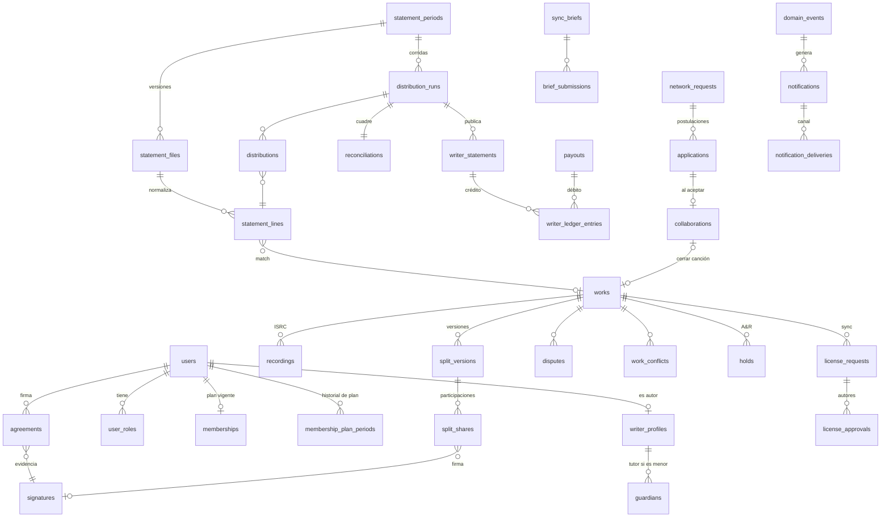

# Pluma: modelo de datos (v0.1, para aprobación)

El DDL completo está en [`schema.sql`](./schema.sql). Se cargó y probó en PostgreSQL 16: el trigger rechaza enviar una versión de split que suma 99,99% y acepta la misma versión con 100,00%, y `audit_log` rechaza `DELETE`.

## 1. Mapa de entidades



## 2. Correspondencia con las entidades pedidas

| Entidad pedida | Tabla(s) | Notas |
|---|---|---|
| User | `users`, `user_roles`, `kyc_checks` | Un usuario puede tener varios roles (autor + A&R). |
| WriterProfile | `writer_profiles`, `guardians`, `tax_profiles`, `payout_methods` | Datos fiscales y bancarios cifrados, separados del perfil. |
| Membership | `plans`, `plan_prices`, `memberships`, `membership_plan_periods`, `membership_payments` | `membership_plan_periods` responde "¿qué comisión aplicaba en esta fecha?" y no admite solapes. |
| Work | `works`, `work_files`, `work_status_history`, `work_conflicts` | Hash de audio y letra + sello RFC 3161. Declaración de IA obligatoria. |
| SplitVersion / SplitShare | `split_versions`, `split_shares`, `signatures` | Porcentajes en puntos básicos (10000 = 100%). Cualquier cambio = versión nueva y firmas nuevas. |
| Recording | `recordings` | `master_controlled_by_writer` habilita la marca one-stop. |
| StatementFile | `statement_periods`, `statement_files` | Archivo crudo write-once con sha256 y versión. |
| StatementLine | `statement_lines`, `match_suggestions`, `work_aliases` | Guarda la línea cruda (`raw`) junto a la normalizada. |
| Distribution | `distribution_runs`, `distributions`, `fx_rates`, `tax_withholding_rules`, `advances`, `reconciliations` | La corrida guarda el *snapshot* de parámetros para reproducir el cálculo. |
| WriterStatement | `writer_statements`, `writer_ledger_entries`, `tax_certificates` | Único por autor y período. |
| Payout | `payouts` | Preparado y aprobado por personas distintas. |
| Request / Application | `network_requests`, `applications`, `collaborations`, `credits`, `audio_plays` | `collaborations` es la base del chat futuro. |
| SyncBrief / LicenseRequest | `sync_briefs`, `brief_submissions`, `sync_rate_card`, `license_requests`, `license_approvals` | |
| Hold | `holds`, `ar_invitations`, `ar_interests` | Un solo hold activo por obra (índice único parcial). |
| AuditLog | `audit_log` | Append-only + cadena de hashes. |
| *(adicionales)* | `domain_events`, `notifications`, `notification_deliveries`, `notification_preferences`, `push_subscriptions`, `disputes`, `publisher_submissions`, `writer_terminations`, `beneficiary_changes`, `data_subject_requests`, `settings`, `publishers` | Eventos, casos borde y cumplimiento. |

## 3. Máquinas de estado

**Obra**

```
Borrador ──enviar (Σ=100%)──▶ Esperando firmas ──todas firmadas──▶ Splits firmados
   ▲                               │ rechazo / reclamo                    │ exportación de alta
   │                               ▼                                      ▼
   └──── nueva versión ◀──── En disputa ◀──── reclamo ──── Enviada a Warner Chappell ──▶ Registrada
```

- En `En disputa` las distribuciones se calculan como `held_dispute` y no entran al saldo hasta resolverse.
- Editar splits de una obra registrada crea la versión N+1 en `Esperando firmas`; la versión N sigue vigente para el cálculo hasta que la N+1 se firma completa.

**Corrida de distribución**

```
draft → calculating → calculated → reconciled ──(aprobador ≠ operador)──▶ approved → scheduled? → published
                                 ↘ unbalanced (bloqueada)
cualquier estado previo a published → invalidated (nuevo archivo, cambio de plan, match manual)
```

**Membresía**: `pending_payment → active → past_due (15 días de gracia) → suspended`; `canceled` al terminar o por salida del autor.

**Postulación**: `pending → accepted | declined | withdrawn`; `pending → expired` a los 7 días, con recordatorio a las 72 h.

## 4. Ejemplo resuelto de distribución

Línea de Chappell: obra *Luna de Barranquilla*, ejecución pública, CO, neto pagado a Pluma **USD 100,00**.

Split vigente: Ana (socia Pro) 50%, Bruno (socio Socio) 30%, Carla (externa, no socia) 20%.

| | Ana (Pro) | Bruno (Socio) | Carla (externa) |
|---|---:|---:|---:|
| Participación | 50,00 | 30,00 | 20,00 → suspenso* |
| Comisión | 15% → 7,50 | 20% → 6,00 | — |
| Retención (ej. 10%, sobre lo que queda tras la comisión) | 4,25 | 2,40 | — |
| **Neto** | **38,25** | **21,60** | — |

\* Si Chappell solo paga las partes administradas (lo esperado), la línea llegaría por 80,00 y no habría suspenso. Si llega por el 100%, los 20,00 quedan en suspenso para revisión y la conciliación los cuenta explícitamente.

Conciliación: 38,25 + 21,60 (autores) + 13,50 (comisión) + 6,65 (retenciones) + 20,00 (suspenso) = **100,00** ✓

## 5. Índices y rendimiento

- Matching: `works.chappell_work_code` e `iswc` únicos; trigramas sobre títulos para sugerencias; índice por `(file_id, match_status)` para la cola.
- Sync: `hnsw` sobre `works.embedding` + `gin` sobre `search_tsv`.
- Statements: `(run_id, writer_user_id)` en distribuciones; un archivo de 1 M de líneas se procesa por lotes de 5.000 en el worker.

## 6. Retención y privacidad

- Líneas, distribuciones, statements, ledger, firmas y auditoría: se conservan durante el plazo contable y contractual (mínimo 10 años), también tras la baja del autor.
- Borrado del titular: se anonimizan `users`, `writer_profiles` y datos de contacto; se conservan los asientos con un seudónimo.
- Menores: `network_visible = false` y fuera de catálogos A&R/Sync salvo autorización expresa del tutor.
